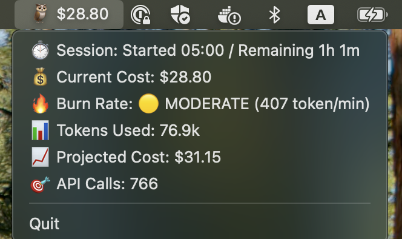

# CCOwl 🦉

A macOS status bar application that monitors Claude Code usage in real-time.

## Features



- **Real-time monitoring**: Displays current Claude Code session costs in your macOS status bar
- **Detailed information**: Click to view comprehensive usage statistics
- **Live updates**: Automatically refreshes every 5 seconds
- **Human-friendly display**: Shows costs, burn rates, and projections in an easy-to-understand format

## Installation

### Download from Releases

Download the latest release for your platform from the [releases page](https://github.com/sivchari/ccowl/releases).

### Build from Source

```bash
git clone https://github.com/sivchari/ccowl.git
cd ccowl
go build -o ccowl
./ccowl
```

## Requirements

- macOS
- [Claude Code CLI](https://docs.anthropic.com/en/docs/claude-code) installed and configured
- The `ccusage` command must be available in your PATH

## Usage

1. Make sure Claude Code CLI is installed and `ccusage` command is working
2. Run CCOwl:
   ```bash
   ./ccowl
   ```
3. The app will appear in your status bar as 🦉 with the current session cost
4. Click on the status bar icon to see detailed information:
   - Session timing and remaining time
   - Current cost and burn rate with status indicators
   - Token usage statistics
   - Projected final costs
   - API call counts

## Status Indicators

- 🟢 **LOW**: < 300 tokens/min
- 🟡 **MODERATE**: 300-700 tokens/min  
- 🔴 **HIGH**: > 700 tokens/min

## Development

### Running Tests

```bash
go test ./...
```

### Running Lint

```bash
go vet ./...
```

## License

MIT License - see [LICENSE](LICENSE) file for details.

## Contributing

Pull requests are welcome! Please make sure tests pass before submitting.
